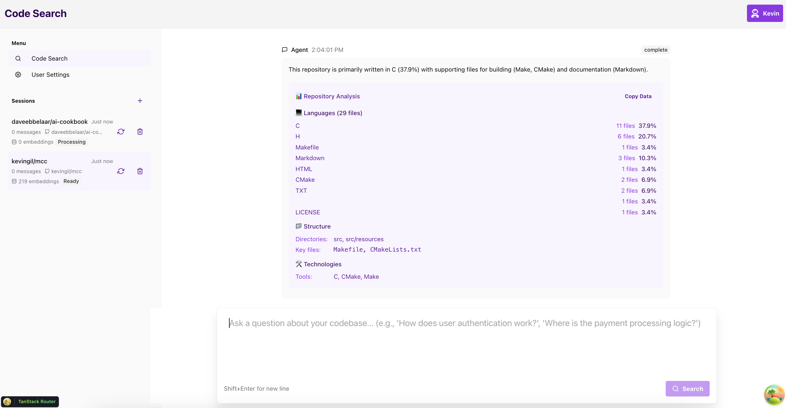

# Agentic Code Search 


[](https://github.com/kevingil/agentic-code-search)


### Setup

You can then update configs in the `.env` files to customize your configurations.

Before deploying it, make sure you change at least the values for:

- `SECRET_KEY`
- `FIRST_SUPERUSER_PASSWORD`
- `POSTGRES_PASSWORD`

You can (and should) pass these as environment variables from secrets.

Read the [deployment.md](./deployment.md) docs for more details.

### Generate Secret Keys

Some environment variables in the `.env` file have a default value of `changethis`.

You have to change them with a secret key, to generate secret keys you can run the following command:

```bash
python -c "import secrets; print(secrets.token_urlsafe(32))"
```

Copy the content and use that as password / secret key. And run that again to generate another secure key.

## How To Use It - Alternative With Copier

This repository also supports generating a new project using [Copier](https://copier.readthedocs.io).

It will copy all the files, ask you configuration questions, and update the `.env` files with your answers.

### Install Copier

You can install Copier with:

```bash
pip install copier
```

Or better, if you have [`pipx`](https://pipx.pypa.io/), you can run it with:

```bash
pipx install copier
```

**Note**: If you have `pipx`, installing copier is optional, you could run it directly.

### Generate a Project With Copier

Decide a name for your new project's directory, you will use it below. For example, `my-awesome-project`.

Go to the directory that will be the parent of your project, and run the command with your project's name:

```bash
copier copy https://github.com/fastapi/full-stack-fastapi-template my-awesome-project --trust
```

If you have `pipx` and you didn't install `copier`, you can run it directly:

```bash
pipx run copier copy https://github.com/fastapi/full-stack-fastapi-template my-awesome-project --trust
```

**Note** the `--trust` option is necessary to be able to execute a [post-creation script](https://github.com/fastapi/full-stack-fastapi-template/blob/master/.copier/update_dotenv.py) that updates your `.env` files.

### Input Variables

Copier will ask you for some data, you might want to have at hand before generating the project.

But don't worry, you can just update any of that in the `.env` files afterwards.

The input variables, with their default values (some auto generated) are:

- `project_name`: (default: `"FastAPI Project"`) The name of the project, shown to API users (in .env).
- `stack_name`: (default: `"fastapi-project"`) The name of the stack used for Docker Compose labels and project name (no spaces, no periods) (in .env).
- `secret_key`: (default: `"changethis"`) The secret key for the project, used for security, stored in .env, you can generate one with the method above.
- `first_superuser`: (default: `"admin@example.com"`) The email of the first superuser (in .env).
- `first_superuser_password`: (default: `"changethis"`) The password of the first superuser (in .env).
- `smtp_host`: (default: "") The SMTP server host to send emails, you can set it later in .env.
- `smtp_user`: (default: "") The SMTP server user to send emails, you can set it later in .env.
- `smtp_password`: (default: "") The SMTP server password to send emails, you can set it later in .env.
- `emails_from_email`: (default: `"info@example.com"`) The email account to send emails from, you can set it later in .env.
- `postgres_password`: (default: `"changethis"`) The password for the PostgreSQL database, stored in .env, you can generate one with the method above.
- `sentry_dsn`: (default: "") The DSN for Sentry, if you are using it, you can set it later in .env.

## Backend Development

Backend docs: [backend/README.md](./backend/README.md).

## Frontend Development

Frontend docs: [frontend/README.md](./frontend/README.md).

## Deployment

Deployment docs: [deployment.md](./deployment.md).

## Development

General development docs: [development.md](./development.md).

This includes using Docker Compose, custom local domains, `.env` configurations, etc.

# Developing MCP & Agents

```bash
# Main Server
fastapi run --reload app/main.py

# MCP Server
uv run python -m app.a2a_mcp --run mcp-server --transport sse --host localhost --port 10100

# Orchestrator Agent
uv run python -m app.a2a_mcp.src.a2a_mcp.agents --agent-card app/a2a_mcp/agent_cards/orchestrator_agent.json --host localhost --port 10101

# Planner Agent
uv run python -m app.a2a_mcp.src.a2a_mcp.agents --agent-card app/a2a_mcp/agent_cards/planner_agent.json --host localhost --port 10102

# These are reference agents from Google's A2A MCP example

# Air Ticketing Agent Reference
uv run python -m app.a2a_mcp.src.a2a_mcp.agents --agent-card app/a2a_mcp/agent_cards/air_ticketing_agent.json --host localhost --port 10103 

#  Hotel Booking Agent Reference
uv run python -m app.a2a_mcp.src.a2a_mcp.agents  --agent-card app/a2a_mcp/agent_cards/hotel_booking_agent.json --host localhost --port 10104

```


## Release Notes

Check the file [release-notes.md](./release-notes.md).

## License

The Agentic Code Search is licensed under the terms of the MIT license.
